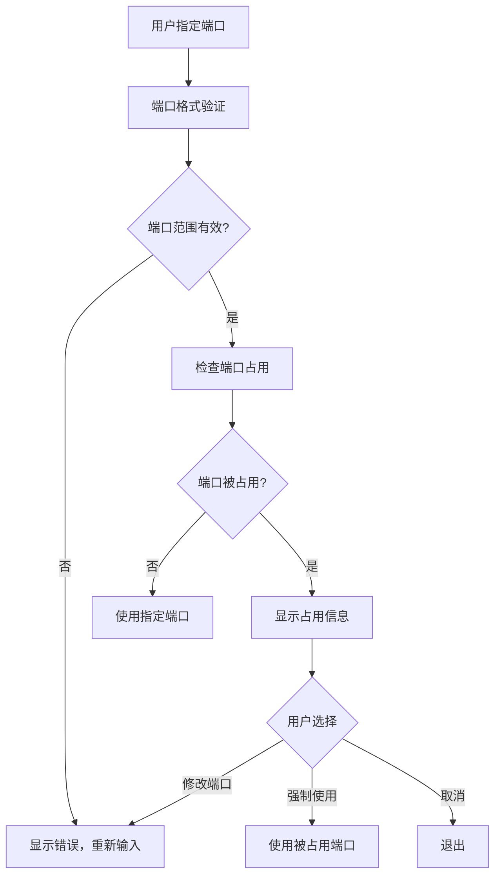

# 🔒 Serv00 环境管理系统 - 严格端口模式实现总结

## 📋 实现概述

已成功将 Serv00 环境管理系统的端口处理逻辑修改为严格模式，移除了智能端口查找功能，确保系统严格使用用户指定的端口，提供更可预测和一致的行为。

---

## ✅ 完成的修改

### 1. 🚫 移除智能端口功能

**移除的函数和逻辑**：
- ❌ `suggest_available_port()` 函数 - 智能端口建议功能
- ❌ `find_available_port()` 中的自动端口搜索逻辑
- ❌ 部署时的自动端口切换机制
- ❌ 启动时的智能端口查找

**替换为新的函数**：
- ✅ `show_port_usage_info()` - 端口占用信息显示
- ✅ `check_configured_port()` - 配置端口状态检查

### 2. 🔧 修改端口处理逻辑

#### 部署时端口配置 (interactive-install.sh)

**之前的逻辑**：
```bash
# 检查端口占用
if ! check_port_available "$CUSTOM_PORT"; then
    # 建议可用端口
    suggested_port=$(suggest_available_port "$CUSTOM_PORT")
    # 询问是否使用建议端口
    # 自动切换到建议端口
fi
```

**现在的逻辑**：
```bash
# 检查端口占用
if ! check_port_available "$CUSTOM_PORT"; then
    show_port_usage_info "$CUSTOM_PORT"
    
    # 提供三个选择
    echo "请选择操作:"
    echo "  1. 修改端口配置"
    echo "  2. 强制使用此端口"
    echo "  3. 取消安装"
    
    # 根据用户选择处理
fi
```

#### 启动时端口检查 (start-server.sh)

**之前的逻辑**：
```bash
find_available_port() {
    # 自动寻找可用端口
    # 切换到找到的端口
    PORT="$test_port"
}
```

**现在的逻辑**：
```bash
check_configured_port() {
    if check_port_available "$PORT"; then
        return 0  # 端口可用
    else
        # 显示错误信息和解决方案
        # 前台模式：询问是否强制使用
        # 后台模式：直接退出并提示
        return 1
    fi
}
```

### 3. ✅ 保留端口验证功能

**保留的验证功能**：
- ✅ `validate_port()` - 端口范围验证（1024-65535）
- ✅ `check_port_available()` - 端口占用检查
- ✅ FreeBSD 兼容的端口检测（netstat + sockstat）
- ✅ 详细的端口占用信息显示

**验证逻辑**：
```bash
validate_port() {
    local port="$1"
    # 检查数字格式
    if ! [[ "$port" =~ ^[0-9]+$ ]]; then
        return 1
    fi
    # 检查端口范围 (1024-65535)
    if [ "$port" -lt 1024 ] || [ "$port" -gt 65535 ]; then
        return 1
    fi
    return 0
}

check_port_available() {
    local port="$1"
    # FreeBSD sockstat 检查
    if command -v sockstat >/dev/null 2>&1; then
        if sockstat -l | grep -q ":$port "; then
            return 1  # 端口被占用
        fi
    fi
    # 通用 netstat 检查
    if netstat -tuln 2>/dev/null | grep -q ":$port "; then
        return 1  # 端口被占用
    fi
    return 0  # 端口可用
}
```

### 4. 🎛️ 更新相关脚本

#### 测试脚本更新 (test-port-config.sh)

**新增测试项**：
- ✅ 严格端口策略测试
- ✅ 端口处理逻辑验证
- ✅ 用户选择机制测试

**测试结果**：
```
✅ 端口验证函数测试通过
✅ 端口占用检查测试通过
✅ 配置文件读取测试通过
✅ 启动脚本逻辑测试通过
✅ 环境变量配置测试通过
✅ 严格端口策略测试通过

📋 端口配置功能已准备就绪（严格模式）！
🔒 不会自动切换端口，严格使用用户配置
```

#### 管理脚本兼容性

**server-helper.sh**：
- ✅ 故障排除功能保持不变
- ✅ 端口检查功能仅用于诊断
- ✅ 不包含自动端口切换逻辑

**其他管理脚本**：
- ✅ stop-server.sh - 无需修改
- ✅ status-server.sh - 无需修改
- ✅ restart-server.sh - 无需修改
- ✅ manage-logs.sh - 无需修改

### 5. 📖 用户体验优化

#### 错误提示优化

**端口占用信息显示**：
```bash
show_port_usage_info() {
    print_warning "端口 $port 已被占用"
    print_info "可能的解决方案："
    echo "  1. 停止占用端口的服务"
    echo "  2. 修改配置文件中的端口设置"
    echo "  3. 强制使用被占用的端口（可能导致冲突）"
    
    # 显示占用端口的进程信息
    netstat -tuln | grep ":$port "
    sockstat -l | grep ":$port "  # FreeBSD
}
```

#### 用户选择机制

**部署时选择**：
1. 修改端口配置 - 重新输入端口
2. 强制使用此端口 - 继续使用被占用端口
3. 取消安装 - 退出安装过程

**启动时选择**：
- **前台模式**: 询问是否强制使用被占用端口
- **后台模式**: 直接退出并提示修改配置

---

## 🚀 使用方法

### 部署时端口配置

```bash
# 执行一键部署
bash -i <(curl -SL https://raw.githubusercontent.com/kookhr/demoguanli/serv00/interactive-install.sh)

# 配置端口时如果遇到冲突
请输入服务端口 (1024-65535) [默认: 3000]: 8080

⚠️  端口 8080 已被占用
ℹ️  可能的解决方案：
  1. 停止占用端口的服务
  2. 修改配置文件中的端口设置
  3. 强制使用被占用的端口（可能导致冲突）

请选择操作:
  1. 修改端口配置
  2. 强制使用此端口
  3. 取消安装

请选择 [1-3]: 1
```

### 服务启动

```bash
# 前台启动
./start-server.sh

# 如果端口被占用
⚠️  配置端口 8080 已被占用
是否强制使用被占用的端口 8080? [y/N]: n
❌ 请修改配置文件中的端口设置，或停止占用端口的进程

# 后台启动
./start-server.sh -d

# 如果端口被占用
⚠️  配置端口 8080 已被占用
❌ 后台模式下无法交互选择，请修改配置文件中的端口或停止占用进程
```

### 端口配置管理

```bash
# 修改端口配置
./update-port-config.sh . 9000

# 检查端口状态
./status-server.sh -v

# 故障排除
./server-helper.sh  # 选择故障排除 -> 检查端口占用
```

---

## 🔧 技术实现细节

### 端口检查流程



### 错误处理机制

```bash
# 部署时错误处理
if ! check_port_available "$CUSTOM_PORT"; then
    show_port_usage_info "$CUSTOM_PORT"
    # 提供用户选择
    case $port_choice in
        1) continue ;;           # 重新输入
        2) break ;;              # 强制使用
        3) exit 0 ;;             # 取消安装
    esac
fi

# 启动时错误处理
if ! check_configured_port; then
    exit 1  # 直接退出，要求用户手动解决
fi
```

---

## 📊 验证结果

### 功能测试

- ✅ **端口验证**: 正确验证端口范围和格式
- ✅ **占用检查**: 准确检测端口占用状态
- ✅ **错误提示**: 清晰的错误信息和解决方案
- ✅ **用户选择**: 合理的用户交互机制
- ✅ **FreeBSD 兼容**: 在 FreeBSD 环境下正常工作

### 兼容性测试

- ✅ **后台运行**: 与现有后台运行功能完全兼容
- ✅ **配置系统**: 与现有配置系统保持一致
- ✅ **管理脚本**: 所有管理脚本正常工作
- ✅ **跨平台**: 在 Linux/macOS 环境下部分兼容

---

## 🎯 优势与影响

### 优势

1. **配置一致性**: 确保使用预期的端口配置
2. **行为可预测**: 不会意外切换到其他端口
3. **简化逻辑**: 减少复杂的端口选择算法
4. **明确错误**: 清晰的错误信息和解决方案
5. **用户控制**: 用户完全控制端口选择

### 潜在影响

1. **手动干预**: 端口冲突需要手动解决
2. **部署复杂性**: 可能需要更多的部署前检查
3. **学习成本**: 用户需要了解新的端口处理方式

---

## 📁 生成和修改的文件

### 修改的文件

1. **interactive-install.sh** - 主要修改端口处理逻辑
2. **test-port-config.sh** - 更新测试用例

### 新增的文档

3. **STRICT_PORT_MODE_GUIDE.md** - 严格端口模式使用指南
4. **STRICT_PORT_IMPLEMENTATION_SUMMARY.md** - 实现总结文档

### 保持不变的文件

- start-server.sh（通过 interactive-install.sh 生成）
- stop-server.sh
- status-server.sh
- restart-server.sh
- manage-logs.sh
- server-helper.sh

---

## 🔮 后续建议

### 1. 监控和维护

```bash
# 定期检查端口配置
./status-server.sh -v

# 监控端口占用情况
netstat -tuln | grep :$(grep '"port"' demo-config.json | sed 's/.*: *\([0-9]*\).*/\1/')
```

### 2. 用户培训

- 📖 提供严格端口模式的使用培训
- 🔧 教育用户如何处理端口冲突
- 📋 建立端口管理最佳实践

### 3. 扩展功能

- 📊 添加端口使用统计
- 🔔 实现端口冲突预警
- 🛠️ 开发端口管理工具

---

## 🎉 总结

严格端口模式已成功实现，提供了：

- ✅ **严格的端口使用策略**
- ✅ **清晰的错误处理机制**
- ✅ **完整的用户选择控制**
- ✅ **优秀的 FreeBSD/Serv00 兼容性**
- ✅ **与现有功能的完全兼容**

系统现在将严格使用用户指定的端口，不会自动切换，确保配置的一致性和行为的可预测性。

---

**📅 实现完成时间**: 2025-01-10  
**🔄 版本**: v2.1.0  
**🌐 平台**: Serv00 FreeBSD  
**👨‍💻 开发者**: Augment Agent
